## 👋 SK네트웍스 Family AI 캠프 22기 👋

<!--

**Here are some ideas to get you started:**

🙋‍♀️ A short introduction - what is your organization all about?
🌈 Contribution guidelines - how can the community get involved?
👩‍💻 Useful resources - where can the community find your docs? Is there anything else the community should know?
🍿 Fun facts - what does your team eat for breakfast?
🧙 Remember, you can do mighty things with the power of [Markdown](https://docs.github.com/github/writing-on-github/getting-started-with-writing-and-formatting-on-github/basic-writing-and-formatting-syntax)
-->


## 강의 소스코드 저장소 

```mermaid
graph TD
    A[04_웹서비스 주간]
    A1[Web Client]
    A2[Web Server]
    A3[DevOps]
    A --> A1
    A --> A2
    A --> A3

    click A "https://github.com/orgs/skn-ai22-251029/projects/37" "웹서비스"
    click A1 "https://github.com/skn-ai22-251029/web_client_workspace" "Web Client - HTML/CSS/Javascript"
    click A2 "https://github.com/skn-ai22-251029/web_server_workspace" "Web Server - Django/FastAPI"
    click A3 "https://github.com/skn-ai22-251029/devops_workspace" "DevOps - Linux/Cloud"

```


### [@04_웹서비스 주간](https://github.com/orgs/skn-ai22-251029/projects/37) 


###### [단위프로젝트4] _LLM 을 연동한 내외부 문서 기반 질의 응답 웹페이지 개발_

```mermaid
graph TD
    
    subgraph 단위프로젝트4
        A1[#64;SKN22-4th-1Team Project]
        A2[#64;SKN22-4th-2Team Project]
        A3[#64;SKN22-4th-3Team Project]
        A4[#64;SKN22-4th-4Team Project]

        %% B1["SKN22-2nd-1Team<br><sub>세부내용</sub>"]
        B1[SKN22-4th-1Team<br><sub>FDA 의약품 정보</sub>]
        B2[SKN22-4th-2Team<br><sub>AI 특허 분석<br>& 선행 기술<br>조사 솔루션</sub>]
        B3[SKN22-4th-3Team<br><sub>ZIPSA:<br>집사들을 위한 <br>반려묘 입양 및<br>케어 지원 챗봇</sub>]
        B4[SKN22-4th-4Team<br><sub>미국 재무제표 분석<br>및 투자 인사이트</sub>]

        A1 -.- B1
        A2 -.- B2
        A3 -.- B3
        A4 -.- B4


    end
    click A1 "https://github.com/orgs/skn-ai22-251029/projects/38" "SKN22-4th-1Team"
    click A2 "https://github.com/orgs/skn-ai22-251029/projects/39" "SKN22-4th-2Team"
    click A3 "https://github.com/orgs/skn-ai22-251029/projects/40" "SKN22-4th-3Team"
    click A4 "https://github.com/orgs/skn-ai22-251029/projects/41" "SKN22-4th-4Team"

    click B1 "https://github.com/skn-ai22-251029/SKN22-4th-1Team" "SKN22-4th-1Team"
    click B2 "https://github.com/skn-ai22-251029/SKN22-4th-2Team" "SKN22-4th-2Team"
    click B3 "https://github.com/skn-ai22-251029/SKN22-4th-3Team" "SKN22-4th-3Team"
    click B4 "https://github.com/skn-ai22-251029/SKN22-4th-4Team" "SKN22-4th-4Team"

```

### [@03_AI 자연어처리 주간](https://github.com/orgs/skn-ai22-251029/projects/30) 

```mermaid
graph TD
    A[#64;03_AI 자연어처리 주간]
    A1[Deep Learning NLP]
    A2[LLM]
    A3[Deep Learning Multimodal]
    A --> A1
    A --> A2
    A --> A3

    click A "https://github.com/orgs/skn-ai22-251029/projects/29" "AI 자연어처리"
    click A1 "https://github.com/skn-ai22-251029/deep_learning_nlp_workspace" "AI 자연어처리 - Deep Learning NLP"
    click A2 "https://github.com/skn-ai22-251029/llm_workspace" "AI 자연어처리 - LLM"
    click A3 "https://github.com/skn-ai22-251029/deep_learning_multimodal_workspace" "AI 자연어처리 - Deep Learning Multimodal"

```



###### [단위프로젝트3] _LLM 연동 내외부 문서 기반 질의 응답 시스템_

```mermaid
graph TD
    
    subgraph 단위프로젝트3
        A1[#64;SKN22-3rd-1Team Project]
        A2[#64;SKN22-3rd-2Team Project]
        A3[#64;SKN22-3rd-3Team Project]
        A4[#64;SKN22-3rd-4Team Project]

        %% B1["SKN22-2nd-1Team<br><sub>세부내용</sub>"]
        B1[SKN22-3rd-1Team<br><sub>FDA 의약품 정보</sub>]
        B2[SKN22-3rd-2Team<br><sub>AI 특허 분석<br>& 선행 기술<br>조사 솔루션</sub>]
        B3[SKN22-3rd-3Team<br><sub>ZIPSA:<br>집사들을 위한 <br>반려묘 입양 및<br>케어 지원 챗봇</sub>]
        B4[SKN22-3rd-4Team<br><sub>미국 재무제표 분석<br>및 투자 인사이트</sub>]

        A1 -.- B1
        A2 -.- B2
        A3 -.- B3
        A4 -.- B4


    end
    click A1 "https://github.com/orgs/skn-ai22-251029/projects/30" "SKN22-3rd-1Team"
    click A2 "https://github.com/orgs/skn-ai22-251029/projects/32" "SKN22-3rd-2Team"
    click A3 "https://github.com/orgs/skn-ai22-251029/projects/33" "SKN22-3rd-3Team"
    click A4 "https://github.com/orgs/skn-ai22-251029/projects/34" "SKN22-3rd-4Team"

    click B1 "https://github.com/skn-ai22-251029/SKN22-3rd-1Team" "SKN22-3rd-1Team"
    click B2 "https://github.com/skn-ai22-251029/SKN22-3rd-2Team" "SKN22-3rd-2Team"
    click B3 "https://github.com/skn-ai22-251029/SKN22-3rd-3Team" "SKN22-3rd-3Team"
    click B4 "https://github.com/skn-ai22-251029/SKN22-3rd-4Team" "SKN22-3rd-4Team"

```

### [@02_AI 기초 주간](https://github.com/orgs/skn-ai22-251029/projects/15) 

```mermaid
graph TD
    A[#64;02_AI 기초 주간]
    A1[Data Analysis]
    A2[Machine Learning]
    A3[Deep Learning Basic]
    A --> A1
    A --> A2
    A --> A3

    click A "https://github.com/orgs/skn-ai22-251029/projects/15" "AI 기초"
    click A1 "https://github.com/skn-ai22-251029/data_analysis_workspace" "AI 기초 - Data Analysis"
    click A2 "https://github.com/skn-ai22-251029/machine_learning_workspace" "AI 기초 - Machine Learning"
    click A3 "https://github.com/skn-ai22-251029/deep_learning_basic_workspace" "AI 기초 - Deep Learning Basic"

```


###### [단위프로젝트2] _가입 고객 이탈 예측_

```mermaid
graph TD
    
    subgraph 단위프로젝트2
        A1[#64;SKN22-2nd-1Team Project]
        A2[#64;SKN22-2nd-2Team Project]
        A3[#64;SKN22-2nd-3Team Project]
        A4[#64;SKN22-2nd-4Team Project]

        %% B1["SKN22-2nd-1Team<br><sub>세부내용</sub>"]
        B1[SKN22-2nd-1Team<br>온라인 쇼핑몰 방문자 <br>행동 데이터 기반 <br> 구매 전환 예측 <br>및 이탈 방지 전략 수립]
        B2[SKN22-2nd-2Team<br>KKOBX 사용자 이탈 예측]
        B3[SKN22-2nd-3Team<br>스포티파이 사용자 이탈 예측 <br> 및 비즈니스 인사이트 <br> 제공 대시보드]
        B4[SKN22-2nd-4Team<br>통신사 가입 고객 이탈 예측]

        A1 -.- B1
        A2 -.- B2
        A3 -.- B3
        A4 -.- B4

            

    end
    click A1 "https://github.com/orgs/skn-ai22-251029/projects/16" "@SKN22-2nd-1Team"
    click A2 "https://github.com/orgs/skn-ai22-251029/projects/17" "@SKN22-2nd-2Team"
    click A3 "https://github.com/orgs/skn-ai22-251029/projects/18" "@SKN22-2nd-3Team"
    click A4 "https://github.com/orgs/skn-ai22-251029/projects/19" "@SKN22-2nd-4Team"

    click B1 "https://github.com/skn-ai22-251029/SKN22-2nd-1Team" "SKN22-2nd-1Team"
    click B2 "https://github.com/skn-ai22-251029/SKN22-2nd-2Team" "SKN22-2nd-2Team"
    click B3 "https://github.com/skn-ai22-251029/SKN22-2nd-3Team" "SKN22-2nd-3Team"
    click B4 "https://github.com/skn-ai22-251029/SKN22-2nd-4Team" "SKN22-2nd-4Team"

```

### [@01_프로그래밍 기초 주간](https://github.com/orgs/skn-ai22-251029/projects/1) 

```mermaid
graph TD
    A[#64;01_프로그래밍 기초 주간]
    A1[Python]
    A2[MySQL]
    A3[Data Collection]
    A --> A1
    A --> A2
    A --> A3

    click A "https://github.com/orgs/skn-ai22-251029/projects/1" "프로그래밍 기초"
    click A1 "https://github.com/skn-ai22-251029/python_workspace" "프로그래밍 기초 - Python"
    click A2 "https://github.com/skn-ai22-251029/mysql_workspace" "프로그래밍 기초 - MySQL"
    click A3 "https://github.com/skn-ai22-251029/data_collection_workspace" "프로그래밍 기초 - Data Collection"

```

###### [단위프로젝트1] _전국 자동차 등록 현황 및 기업 FAQ 조회시스템_

```mermaid
graph TD
    
    subgraph 단위프로젝트1
        A1[#64;SKN22-1st-1Team Project]
        A2[#64;SKN22-1st-2Team Project]
        A3[#64;SKN22-1st-3Team Project]
        A4[#64;SKN22-1st-4Team Project]

        %% B1["SKN22-1st-1Team Repo<br><sub>세부내용</sub>"]
        B1[SKN22-1st-1Team Repo<br><sub>교통사고 현황과 안전팁을 제공하는 통합정보플랫폼</sub>]
        B2[SKN22-1st-2Team Repo<br><sub>전기차충전소 통합정보시스템</sub>]
        B3[SKN22-1st-3Team Repo<br><sub>국내자동차 시장트렌드 분석</sub>]
        B4[SKN22-1st-4Team Repo<br><sub>중고차리콜 조회서비스</sub>]

        A1 -.- B1
        A2 -.- B2
        A3 -.- B3
        A4 -.- B4

            

    end
    click A1 "https://github.com/orgs/skn-ai22-251029/projects/5" "@SKN22-1st-1Team"
    click A2 "https://github.com/orgs/skn-ai22-251029/projects/6" "@SKN22-1st-2Team"
    click A3 "https://github.com/orgs/skn-ai22-251029/projects/7" "@SKN22-1st-3Team"
    click A4 "https://github.com/orgs/skn-ai22-251029/projects/8" "@SKN22-1st-4Team"

    click B1 "https://github.com/skn-ai22-251029/SKN22-1st-1Team" "SKN22-1st-1Team"
    click B2 "https://github.com/skn-ai22-251029/SKN22-1st-2Team" "SKN22-1st-2Team"
    click B3 "https://github.com/skn-ai22-251029/SKN22-1st-3Team" "SKN22-1st-3Team"
    click B4 "https://github.com/skn-ai22-251029/SKN22-1st-4Team" "SKN22-1st-4Team"

```


